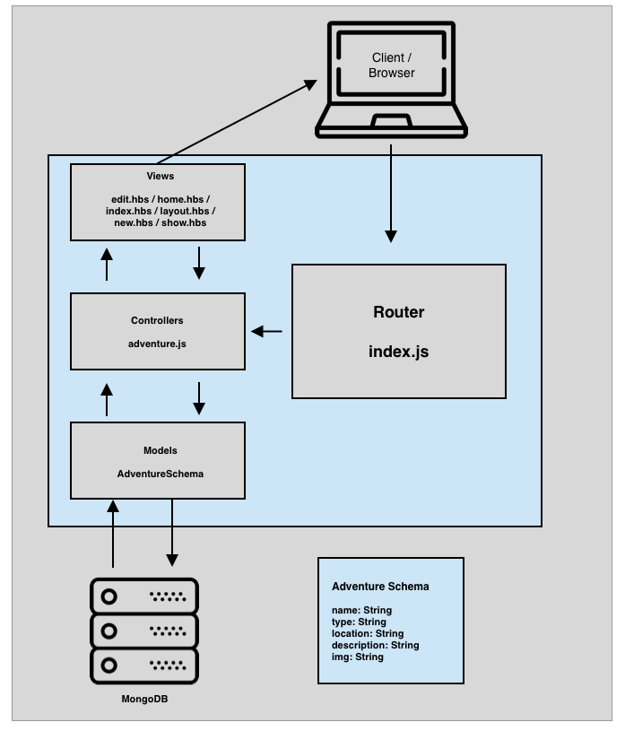

# Project-2 - Adventure Project

## User Story
Adventure Project is a Full Stack Web Application built during my time at General Assembly in a Software Engineering Immersive Program. The idea of Adventure Project comes from a desire to share adventures with the community. Using HTML, CSS, JavaScript, Express, Handlebars and Mongoose I created a full-stack application to help the outdoor enthusiests show, create, edit and delete there adventures in a blog style format.
### Successes
Some successes were the ability to add and allow users to had images

### Things to work on  and difficulties
Some difficulties were seperating types of adventures so then there could be a specific page for each type of advenutre.

## Full-Stack Web Application Diagram for Adventure Project



## Getting Started

These instructions will get you a copy of the project up and running on your local machine for development and testing purposes. See deployment for notes on how to deploy the project on a live system.


### Installing

In order to get a development env running you must first clone the repository to your local server.

You must run mongoose, type in terminal:
```
mongod 
```

Next you must run nodemon, type in terminal:

```
nodemon index.js
```
Finally in order to retrieve the data you must type in your terminal:

```
node db/seed.js
```

## Built With
HTML
CSS
JavaScript
Mongoose
Express
Handlebars

## Contributing

Would love help creating user profiles where they can select adventures and mark when they complete.

For contributions please submit pull request here. (https://github.com/10jferzacca/Project-2-Adventure)


## Authors


**JonPaul Ferzacca** 


## Acknowledgments

* Inspiration from Ross Hasting 
